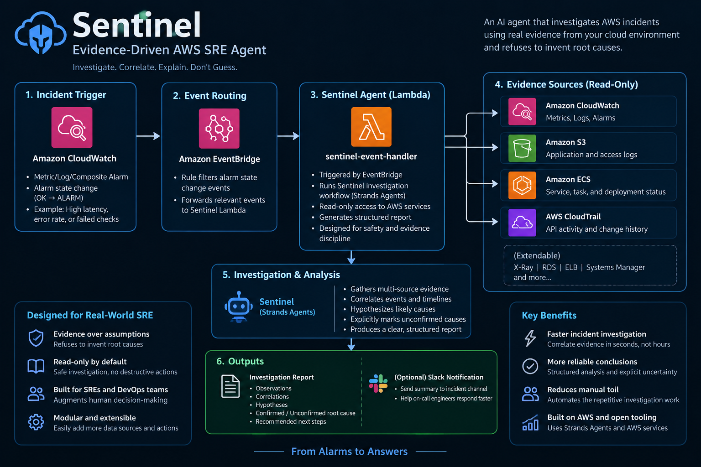

# Sentinel — Evidence-Driven AWS SRE Agent

> Investigate. Correlate. Explain. Don't Guess.

Sentinel is an AI-powered AWS SRE investigation agent built with **Strands Agents**. It investigates operational incidents across AWS observability sources, correlates evidence around a selected incident timestamp, and produces a structured investigation report while explicitly separating observations, correlations, hypotheses, and confirmed causes.

## Why Sentinel?

Incident investigation often means jumping between CloudWatch alarms, metrics, application telemetry, ECS state, logs, and CloudTrail history. The repetitive correlation work is slow, and automated systems can easily turn a plausible correlation into an unsupported root-cause claim.

Sentinel is designed to reduce that investigation toil without sacrificing evidence discipline.

## What Sentinel does

1. Selects the relevant incident from CloudWatch alarm history.
2. Anchors investigation to the selected incident timestamp.
3. Gathers read-only evidence from:
   - Amazon CloudWatch
   - CloudWatch Logs
   - Amazon ECS
   - AWS CloudTrail
4. Uses historical ECS attribution when investigating past incidents.
5. Correlates independent evidence sources.
6. Uses a bounded reviewer/revision loop to catch unsupported claims.
7. Produces a concise final investigation report.
8. Explicitly reports uncertainty when the evidence does not establish causality.

A central design rule is:

**Temporal or quantitative correlation does not automatically establish causation.**

When evidence is insufficient, Sentinel reports:

`ROOT CAUSE: UNCONFIRMED`

## Architecture



The event-driven AWS deployment path is:

`CloudWatch Alarm → EventBridge → Lambda → Sentinel → AWS evidence sources → Investigation Report`

The Lambda is deployed as a container image stored in Amazon ECR. Its execution role is read-only for investigation services and retrieves the model/API credential from AWS Systems Manager Parameter Store.

## Event-driven integration

The deployed prototype includes:

- CloudWatch alarm state-change event
- Amazon EventBridge rule filtering `sentinel-high-latency` ALARM events
- EventBridge target connected to `sentinel-event-handler`
- Lambda resource-based permission allowing the EventBridge rule to invoke the function
- Container-image Lambda deployment backed by Amazon ECR
- SSM Parameter Store lookup for the runtime API credential

The direct AWS Lambda invocation was also validated successfully, and the real CloudWatch → EventBridge → Lambda path was exercised with a test alarm state transition.

## Evaluation

Sentinel includes a deterministic evaluation suite covering five incident fixtures:

- single slow request
- CPU pressure
- missing application logs
- historical ECS task attribution
- CloudTrail evidence gaps

Current evaluation result:

- **5/5 report scenarios passed**
- **5/5 reviewer convergence**

The evaluation deliberately checks for unsafe claims such as unsupported causal language and incorrect assumptions based on missing CloudTrail events.

## Safety and evidence discipline

Sentinel is intentionally read-only during investigation.

It does not infer endpoint behavior from endpoint names, paths, methods, or HTTP status codes. It does not treat absence of queried CloudTrail events as proof that no deployment or infrastructure change occurred. It does not substitute a currently running ECS task for historical evidence.

Mutating or destructive actions are outside the investigation workflow and require explicit human approval.

## Tech stack

- Python
- Strands Agents
- AWS CloudWatch
- Amazon CloudWatch Logs
- Amazon ECS
- AWS CloudTrail
- Amazon EventBridge
- AWS Lambda
- Amazon ECR
- AWS Systems Manager Parameter Store
- Docker

## Repository structure

```text
sentinel-sre-agent/
├── agent/
│   ├── agent.py
│   ├── credentials.py
│   ├── event_handler.py
│   ├── reviewer.py
│   ├── review_pipeline.py
│   └── tools.py
├── evaluation/
│   ├── cases.json
│   ├── fixtures/
│   ├── reviewer_test.py
│   └── run_eval.py
├── lambda/
│   ├── Dockerfile
│   └── requirements.txt
├── app/
├── docs/
│   ├── aws-field-notes.md
│   └── sentinel-architecture.png
└── README.md
```

## Running locally

Create a virtual environment, install dependencies, configure the required AWS/model credentials, then run the CLI entry point or the evaluation suite.

Example:

```powershell
python -m evaluation.reviewer_test
python -m evaluation.run_eval
```

## Project story

Sentinel started as an incident-investigation prototype and grew into an event-driven AWS deployment. A major part of the implementation was validating the boundaries between local development, Docker, AWS SSO, IAM Identity Center, IAM execution roles, ECR, Lambda, EventBridge, and runtime secret retrieval.

The goal was not to hide those boundaries, but to make them explicit and testable.

## Built for

**SREs, DevOps engineers, and cloud operators** who need faster incident investigation while keeping automated conclusions grounded in evidence.

---

Built for the **Agents for Humans Hackathon**.
